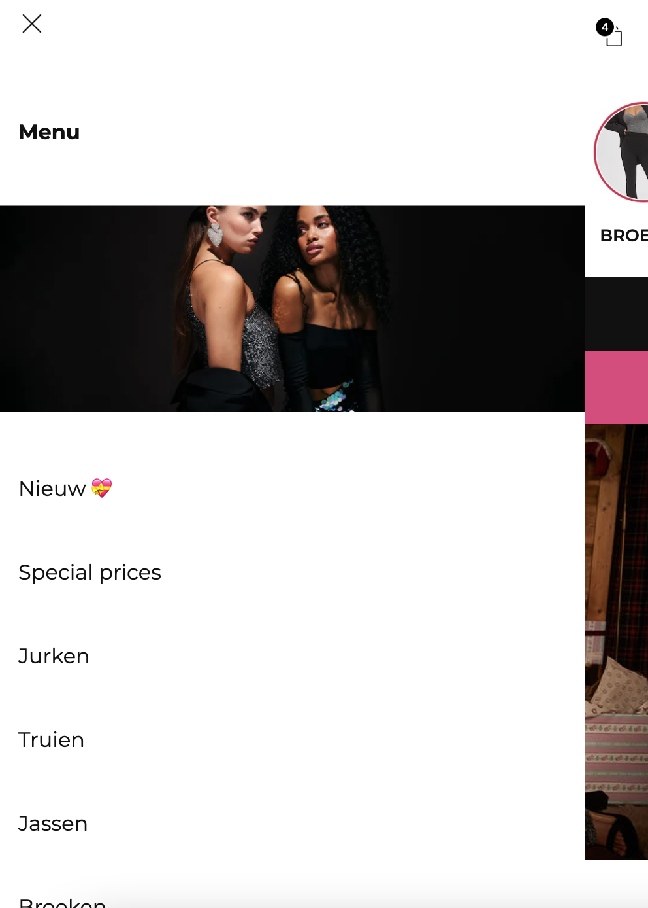
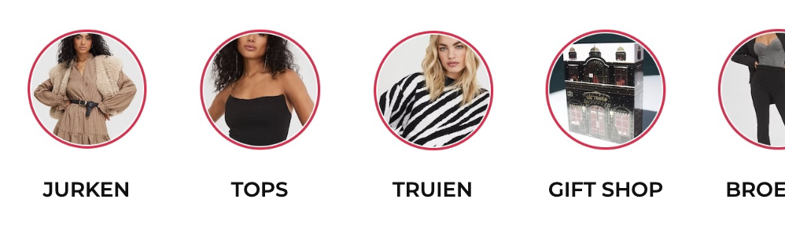
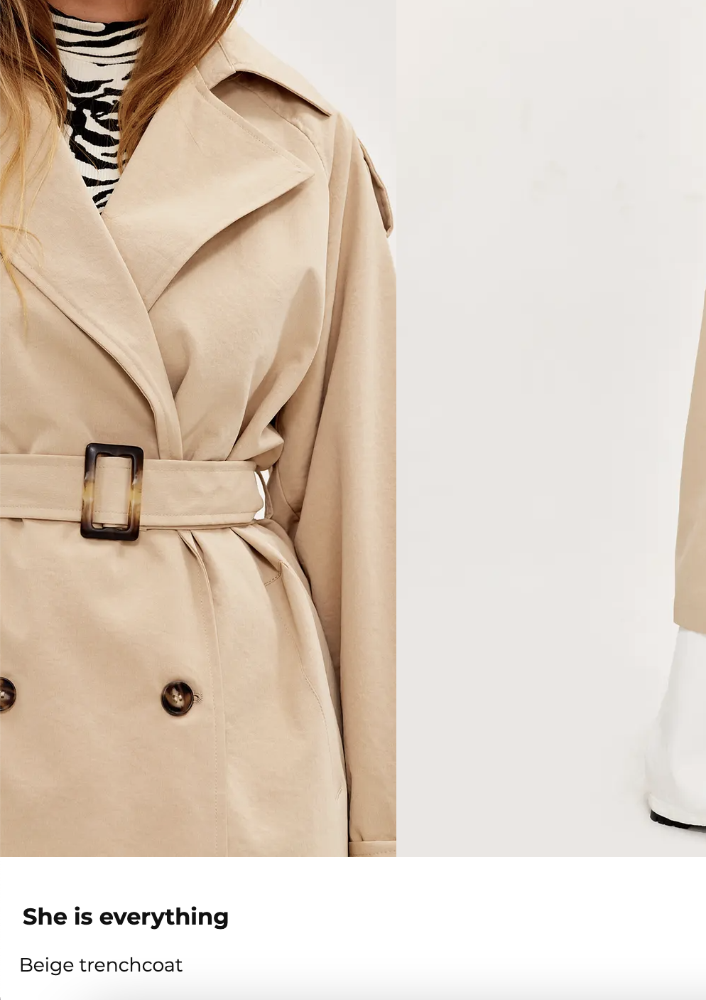

# Procesverslag
Markdown is een simpele manier om HTML te schrijven.  
Markdown cheat cheet: [Hulp bij het schrijven van Markdown](https://github.com/adam-p/markdown-here/wiki/Markdown-Cheatsheet).

Nb. De standaardstructuur en de spartaanse opmaak van de README.md zijn helemaal prima. Het gaat om de inhoud van je procesverslag. Besteedt de tijd voor pracht en praal aan je website.

Nb. Door *open* toe te voegen aan een *details* element kun je deze standaard open zetten. Fijn om dat steeds voor de relevante stuk(ken) te doen.

## Jij

  
uitwerken voor kick-off werkgroep

  ### Auteur:
  Minke Deken

  #### Je startniveau:
  Rood

  #### Je focus:
  Waarschijnlijk surface plane
 

## Je website

  
uitwerken voor kick-off werkgroep

  ### Je opdracht:
  Loavies site, https://www.loavies.com/nl/?gclsrc=aw.ds&gclid=CjwKCAjwwsmLBhACEiwANq-tXHd1rEb6Jy8CLY_bfHC-b3J-Y1hbldF8_NXR47WAlGuVvlFbfYDzfBoCL6IQAvD_BwE

  #### Screenshot(s) van de eerste pagina (small screen): 
  Home pagina  
  

  #### Screenshot(s) van de tweede pagina (small screen):
  Shop pagina  
  
 

## Toegankelijkheidstest 1/2 (week 1)

  
uitwerken na test in 1e werkgroep

  ### Bevindingen
  Lijst met je bevindingen die in de test naar voren kwamen:

  - Tabs werken niet, er is geen focus state
  - Screenreader is matig, geen duidelijke links
  - Met wazig zicht zijn de lettertypes misschien iets te klein
  - Met parkinson simulatie werkt de site matig

  #### Screenreader
  Met de screenreader was het besturen van de website erg chaotisch. Sommige dingen waren prima uitgewerkt maar de meeste dingen waren niet duidelijk en
  dus echt niet goed te gebruiken.

  #### Muis en Toetsenbord 
  Er is helemaal geen focus functie, je kunt de site dus niet bedienen met alleen toetsenbord (tab).
  Dit kan verbeterd worden door aan alle elementen focus functies toe te voegen.

  #### Motoriek (shocks, elastiekjes)
   Tijdens het testen met de shocks kwam ik er achter dat de site wel moeilijk te gebruiken is door kleine links etc. (toevoegen aan verlanglijst bijv.)
   Dat is op te lossen door misschien de verlanglijst knop verder weg zetten en meer ruimte geven.

  #### Visueel (brillen, contrast, kleurenblind, dark/light). 
  Ik kwam er achter dat met een bepaalde bril de kleine tekst een beetje moeilijk te lezen was, dat zou je groter kunnen maken of een duidelijkere kleur
  kunnen geven.

## Breakdownschets (week 1)

  
uitwerken na afloop 2e werkgroep

  ### de hele pagina: 
  

  ### dynamisch deel (bijv menu): 
  

## Voortgang 1 (week 2)

  
uitwerken voor 1e voortgang

  ### Stand van zaken
  In de eerste 2 weken heb ik een begin gemaakt aan mijn website. Ik was blij verrast over hoe de dingen er uiteindelijk uit kwamen te zien. 

  Ik vind het plaatjes en buttons over afbeeldingen plaatsen nog wel moeilijk, en ik wil graag weten hoe je dit het best kunt doen om de site ook mooi responsive te houden.
  

  ### Agenda voor meeting
  samen met je groepje opstellen

  | Minke                        | Mines              | Tamara       | Alexia           |
  | ---                          | ---                | ---          | ---              |
  | button over image responsive | en dit             | en ik dit    | en dan ik dat    |
  | javascript screen width      | dit als er tijd is | nog een punt | dit wil ik zeker |
  | verlanglijstknop             | ...                | ...          | ...              |

  ### Verslag van meeting
  hier na afloop snel de uitkomsten van de meeting vastleggen

  - DIV met container? (ga ik misschien doen)
  - doe geen responsive dus niet nodig
  - verlanglijstknop gefixt

## Voortgang 2 (week 3)

  
uitwerken voor 2e voortgang

  ### Stand van zaken
  Ik vind het leuk om te coderen en dingen te laten werken maar ik vind het nog wel erg lastig. En dan ben ik soms geneigd om het niet meer leuk te vinden. 

  ### Agenda voor meeting
  samen met je groepje opstellen

  | Minke     | student 2          | student 3    | student 4        |
  | ---            | ---                | ---          | ---              |
  | br gebruiken?? | en dit             | en ik dit    | en dan ik dat    |
  | selector van p | dit als er tijd is | nog een punt | dit wil ik zeker |
  |             | ...                | ...          | ...              |

  ### Verslag van meeting
  hier na afloop snel de uitkomsten van de meeting vastleggen

  - br niet, gebruik een li
  - class van de body was fout, moest zonder hoofdletter!
  

## Toegankelijkheidstest 2/2 (week 4)

  
uitwerken na test in 8e werkgroep

  ### Bevindingen
  Lijst met je bevindingen die in de test naar voren kwamen (geef ook aan wat er verbeterd is):

  #### Screenreader
  - geen h1?
  - headings volgensmij goed, lijkt me wel. er is alleen geen H1 ergens. weet niet of je die hebt
  - ze zegt bij de 'stories' bovenin twee keer swim swim omdat de alt tekst van de foto in de a tag ook waarschijnlijk swim is. 

  #### Muis en Toetsenbord 
  - zeker goed te doen
  - in het begin met tabben in het onzichtbare menu.
  - focus state volgensmij nog niet vormgegeven, zie alleen de basic focus state van apple zelf.
  - hover state goed!!!!! alles dat interactief is heeft een hover state. 

  #### Motoriek (shocks, elastiekjes)
  - buttons en links groot genoeg, favoriet button misschien wat klein voor mensen met spasmes bv maar de ruimte eromheen die ook reageert maakt dit erg goed.

  #### Visueel (brillen, contrast, kleurenblind, dark/light). 
  - ook met kleurenblindheid toegankelijk. Grote contrasten tussen de kleuren dus zichtbaar.
  - buttons en links groot genoeg, favoriet button misschien wat klein voor mensen met spasmes bv maar de ruimte eromheen die ook reageert maakt dit erg goed.

## Voortgang 3 (week 4)

  
uitwerken voor 3e voortgang

  ### Stand van zaken
  hier dit ging goed & dit was lastig (neem ook screenshots op van delen van je website en code)

  ### Agenda voor meeting
  samen met je groepje opstellen

  | Minke          | student 2          | student 3    | student 4        |
  | ---            | ---                | ---          | ---              |
  | meerdere navs  | en dit             | en ik dit    | en dan ik dat    |
  | dubbele tekst sr| dit als er tijd is | nog een punt | dit wil ik zeker |
  | ...            | ...                | ...          | ...              |

  ### Verslag van meeting
  hier na afloop snel de uitkomsten van de meeting vastleggen

  - meerdere navs mag
  - andere alt tekst neerzetten
  - form
  - buttons responsive maken
  - focus en active state
  

## Eindgesprek (week 5)

  
uitwerken voor eindgesprek

  ### Je uitkomst - karakteristiek screenshots:
  

  

  ### Dit ging goed/Heb ik geleerd: 
  Ik vond het over het algemeen erg leuk om te doen. Ik ben vooral trots op het feit dat ik flexbox snap nu! Dat snapte ik vorig jaar met internetstandaarden echt totaal niet. Ik ben vooral trots op mijn overflow-x menu. Daarnaast vind ik het leuk dat het werkende menu is gelukt (met wat hulp).

  Ook vind ik de animaties leuk die ik heb geprobeerd.

  
  

  ### Dit was lastig/Is niet gelukt:
  - Darkmode, want ik had voor buttons plaatjes gebruikt dus dat zag er echt heel raar uit. Maar voor de   rest snap ik me de media preference wel hoe dat werkt.
  - Heel erg responsive met buttons etc.
  -Om de foto's automatisch te laten staan op 1 foto bij de 2e pagina.

  

## Bronnenlijst

  
continu bijhouden terwijl je werkt

  Nb. Wees specifiek ('css-tricks' als bron is bijv. niet specifiek genoeg).

  1. https://www.w3schools.com/html/html5_video.asp > Gebruikt om een video toe te voegen
  2. Finn, Ymaro, Vasilis

